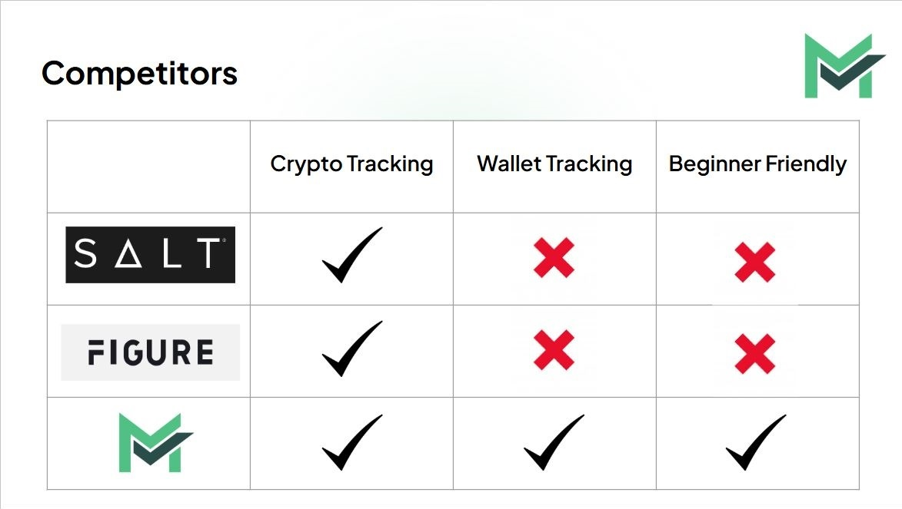

# MicroVault

## Loans backed by crypto

---

## **Check Out MicroVault**
- [Demo Video](https://www.loom.com/share/d1e10cd0cd11451a80ec17108e2db7b4?sid=951ccc05-a3b3-4ad4-8840-9afd265aaf27)
- [Live Platform](https://microvault.netlify.app)

---

## **Purpose**
MicroVault is a platform designed to:

- Make microloans accessible to crypto users, especially individuals and small businesses.
- Provide a safe and secure platform for borrowing, using over-collateralization to reduce risk.
- Offer flexible loan terms tailored to the needs of crypto users.
- Ensure quick and reliable access to liquidity while maintaining transparency and security.
- Solve the problem of limited loan options in the crypto space.

---

## **Background**
- Cryptocurrencies enable direct, bankless financial transactions globally.
- Bitcoin's fixed supply makes it a potential hedge against inflation.
- Major institutions increasingly adopt crypto, boosting its legitimacy.
- Crypto loans require excess collateral for security.

---

## **General Terminology**

- **Blockchain**: A decentralized digital ledger recording immutable transactions in linked blocks.
- **Cryptocurrency**: Digital currency using cryptography and blockchain for security.
- **Ethereum**: Blockchain platform for building decentralized apps and smart contracts.

### **MicroVault Terminology**

- **Lending**: Provide crypto assets to earn interest. Assets serve as secured collateral for borrowers.
- **Borrowing**: Access funds by over-collateralizing crypto assets, maintaining exposure to price gains without selling.
- **Crypto Score**: Based on Ethereum activity, collateral value, and loan history. Higher scores unlock better rates and limits.

---

## **Goals**

- Enable login/logout using any crypto wallet.
- Provide functionality to borrow and lend crypto assets.
- Make borrowing/lending easy to understand for users.
- Offer a dashboard to view the health of assets.
- Discover new cryptocurrencies to invest in.

---

## **Tech Stack**

### **Frontend**
- React
- Vite
- Tailwind CSS

### **Backend**
- Node.js
- Hardhat
- Firebase
- Solidity
- Ethereum

### **Tools/APIs**
- VS Code
- Git
- Web3.js
- MetaMask
- CoinGecko
- TradingView

---

## **How to Use MicroVault**

### Prerequisites

1. Install a hot wallet such as **MetaMask** as a browser extension (e.g., on Google Chrome).
2. Ensure your wallet is funded with sufficient cryptocurrency for collateral. Note: MicroVault uses the **Sepolia Testnet** for transactions.
3. Check out our [live platform](https://microvault.netlify.app) or view the [demo](https://www.loom.com/share/d1e10cd0cd11451a80ec17108e2db7b4?sid=951ccc05-a3b3-4ad4-8840-9afd265aaf27).

### Borrowing
1. Login using MetaMask.
2. Navigate to the **Borrow** section.
3. Select the amount and duration for your loan.
4. Provide collateral and confirm the transaction through your wallet.

### Lending
1. Login using MetaMask.
2. Navigate to the **Lending** section.
3. View available loans to fund.
4. Confirm your selection and lend assets to earn interest.

---

## **Our Smart Contract**

### Core Functions

- `requestLoan(principal, interest, duration, collateral)`: Create a loan request.
- `fundLoan(loanId)`: Fund an active loan request.
- `calculateTotalRepayment(loanId)`: Calculate the total amount owed for a specific loan.
- `repayLoan(loanId)`: Repay the borrowed amount with interest.

#### Value Verification
- All values must be positive.
- Loans require 150% collateralization.
- Wallets must contain sufficient collateral to proceed.

---

## **Consensus Mechanisms**

### Proof of Stake (PoS)

- Validators are selected based on the amount of cryptocurrency staked.
- Ensures the addition of valid blocks to the blockchain.
- Keeps smart contracts safe by ensuring execution occurs on a tamper-proof ledger.

---

## **Liquidity Pool**

- Acts as a reserve for collateral, loan funds, and repayments.
- Focuses on specific loans rather than general pooling.
- Ensures fund availability, building trust among users.

---

## **Competitors**

Here are some of the competitors in the microloan and crypto lending space and how MicroVault competes against them:

---

## **Team Members**

- **Jordan Joelson** - Frontend Developer
- **Veer Shah** - Project Manager
- **Aastha Sharma** - Fullstack Developer
- **Aarya** - Fullstack Developer
